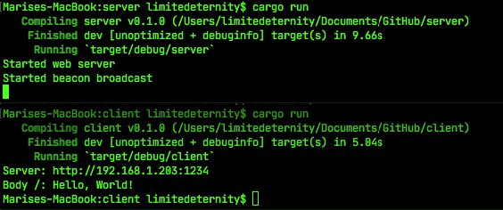

# AutoConnectDemo
> Demonstration of automatic connection establishment between client and server on local network

## Screenshot

## What's going on?

Both client and server are written in Rust. 

Server runs a periodic UDP broadcast (to disclose its IP address for clients on local network) and a web-server simultaneously. 

Client recieves UDP-broadcasted message, verifies it, looks up the source of this message and initiates a TCP connection to the looked up source. Client connects to a web-server and recieves "Hello, World!" from it.

## Meta

Distributed under the MIT license. See ``LICENSE`` for more information.

[@limitedeternity](https://github.com/limitedeternity)
